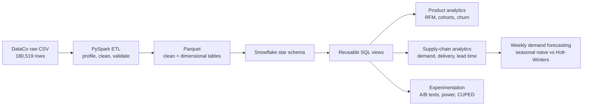
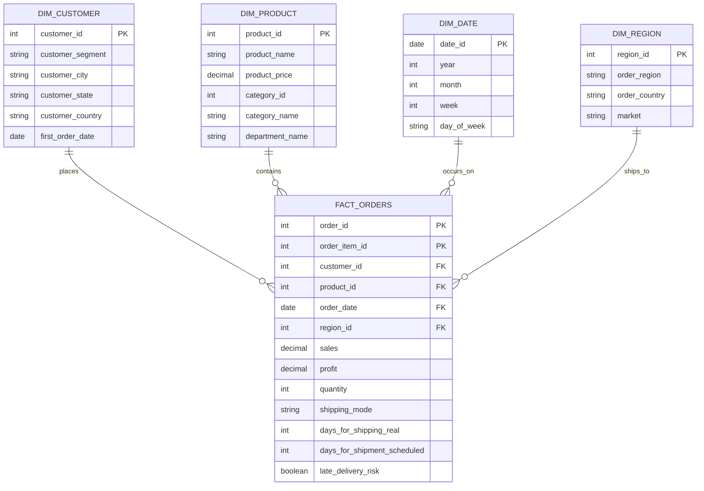

# Retail Analytics & Experimentation Platform

> An end-to-end portfolio project that turns 180,519 raw retail order-item records into a Snowflake analytics warehouse, customer insights, supply-chain forecasts, and a statistically rigorous A/B-testing workflow.


## Why this project

Most public analyses of the DataCo dataset focus on one task: a dashboard, exploratory analysis, or a prediction model. This project uses the same source to demonstrate a complete analytics lifecycle:

- clean and validate raw data with PySpark;
- model it as a reusable Snowflake star schema;
- analyze customer behavior with RFM, cohorts, retention, and churn;
- measure operational demand and delivery performance;
- forecast weekly category demand with honest time-based evaluation;
- validate an A/B-testing engine with known effects, power analysis, and CUPED.

The result is a compact analytics platform rather than a collection of disconnected notebooks.

## Architecture



## Warehouse model



## Validated results

### Data foundation

| Check | Result |
|---|---:|
| Clean order-item rows | 180,519 |
| Duplicate order/order-item keys | 0 |
| Null primary-key fields | 0 |
| Date range | 2015-01-01 to 2018-01-31 |
| Customers | 20,652 |
| Products | 118 |
| Total sales | $36.78M |
| Total profit | $3.97M |

### Product analytics

- **RFM segmentation:** separated recent one-time buyers, loyal customers, at-risk customers, and lost customers using Snowflake `NTILE` scoring.
- **Retention:** mature cohorts generally stabilized around **11–17% monthly activity** after acquisition.
- **Churn:** created a transparent 90-day inactivity flag and documented why frequency separation and feature collinearity initially broke the explanatory regression.

Walkthrough: [product analytics notebook](analytics/product/module2_walkthrough.ipynb)

### Supply-chain analytics

| Finding | Result |
|---|---:|
| Overall late-delivery rate | 54.8% |
| On-time fulfillment proxy | 45.2% |
| First Class late rate | 95.3% |
| Second Class late rate | 76.6% |
| Same Day late rate | 45.7% |
| Standard Class late rate | 38.1% |
| Highest-volume category | Cleats — 73,734 units |
| Highest-volume region | Central America — 62,091 units |

First Class averaged **2 actual days against a 1-day promise**; Second Class averaged roughly **4 days against a 2-day promise**. Standard Class nearly matched its 4-day promise, suggesting that faster service levels were systematically overpromised.

### Demand forecasting

The five highest-volume categories were evaluated using the final 12 weeks as an unseen test period. A 52-week seasonal-naive baseline was compared with additive Holt-Winters; the lower-WAPE model won separately for each category.

| Category | Selected model | MAE | WAPE |
|---|---|---:|---:|
| Cleats | Seasonal naive | 68.3 | 14.6% |
| Women's Apparel | Seasonal naive | 64.6 | 15.8% |
| Cardio Equipment | Seasonal naive | 40.7 | 16.8% |
| Shop By Sport | Holt-Winters | 41.1 | 19.7% |
| Indoor/outdoor Games | Holt-Winters | 79.5 | 22.9% |

Choosing the simple baseline for three categories is intentional: model selection is based on unseen data, not model complexity.

Walkthrough: [supply-chain analytics notebook](analytics/supply_chain/module3_walkthrough.ipynb)

### Experimentation and CUPED

A reproducible 50/50 customer experiment injected known effects into treatment, allowing the statistical engine to be checked against ground truth.

| Experiment result | Value |
|---|---:|
| Eligible customers | 8,190 |
| Customers per group | 4,095 |
| Injected order-value uplift | 5.0% |
| Estimated order-value uplift | 5.12% |
| Raw 95% CI | $8.58 to $12.10 |
| Repeat-purchase uplift | 5.20 percentage points |
| Pre/outcome correlation for CUPED | 0.540 |
| CUPED variance reduction | 29.2% |
| Confidence-interval narrowing | 16.0% |
| Continuous-metric achieved power | ~100% |
| Conversion-metric achieved power | 99.5% |

The module also includes a Corporate-vs-Consumer comparison explicitly labelled **observational, not causal**.

Walkthrough: [experimentation notebook](experimentation/module4_walkthrough.ipynb)

## Technology choices

| Layer | Technology | Purpose |
|---|---|---|
| Data processing | PySpark | Schema inference, cleaning, typing, validation, dimensional outputs |
| Storage | Parquet | Efficient local handoff between ETL and warehouse loading |
| Warehouse | Snowflake | Star schema, governed analytical tables, reusable SQL views |
| Analysis | pandas, SciPy, statsmodels | Segmentation, retention, testing, power, forecasting |
| Visualization | Matplotlib, Seaborn | Reproducible analytical figures |
| Documentation | Markdown, Mermaid, Jupyter | Recruiter-facing overview and detailed reasoning |

## Repository map

```text
etl/                      PySpark profiling, cleaning, validation, schema build
warehouse/                Snowflake DDL, loader, and analytical SQL views
analytics/product/        RFM, cohort retention, churn analysis
analytics/supply_chain/   Demand, delivery, lead-time, and forecasting analysis
experimentation/          A/B tests, CUPED, power analysis, walkthrough
PROJECT_PLAN.md            Scope, design decisions, and build plan
```

## Reproduce the project

### 1. Install dependencies

```bash
python -m venv venv
source venv/bin/activate          # Windows: venv\Scripts\activate
pip install -r requirements.txt
```

### 2. Add the dataset

Download the **DataCo SMART SUPPLY CHAIN FOR BIG DATA ANALYSIS** dataset and place `DataCoSupplyChainDataset.csv` under `data/raw/`.

Original source: [Mendeley Data, version 5](https://data.mendeley.com/datasets/8gx2fvg2k6/5) — DOI `10.17632/8gx2fvg2k6.5`.

### 3. Build and validate the local data foundation

```bash
python etl/profile_raw.py
python etl/clean.py
python etl/validate_clean.py
python etl/build_star_schema.py
```

### 4. Configure Snowflake

Create a local `.env` containing:

```env
SNOWFLAKE_ACCOUNT=
SNOWFLAKE_USER=
SNOWFLAKE_PASSWORD=
SNOWFLAKE_WAREHOUSE=
SNOWFLAKE_DATABASE=
SNOWFLAKE_SCHEMA=
SNOWFLAKE_ROLE=
```

Create the warehouse tables and views from `warehouse/`, then load the dimensional outputs:

```bash
python warehouse/load_to_snowflake.py
```

Snowflake DDL, loading code, and analytical views are stored under `warehouse/`.

### 5. Run the analyses

```bash
python -m analytics.product.rfm_segmentation
python -m analytics.product.cohort_retention
python -m analytics.product.churn_analysis

python -m analytics.supply_chain.demand_analysis
python -m analytics.supply_chain.delivery_analysis
python -m analytics.supply_chain.demand_forecasting

python -m experimentation.synthetic_split
python -m experimentation.run_experiment
```

Generated charts and CSV outputs are intentionally gitignored and can be reproduced from these commands.

## Important limitations

- This public dataset contains **order-item records**, not live inventory snapshots; on-time fulfillment is a delivery proxy, not a true inventory fill rate.
- A sharp volume shift near late 2017 limits forecast reliability. Forecasts demonstrate correct evaluation, not production inventory guidance.
- The A/B effects are synthetic and validate the experiment engine; they are not results from a real business intervention.
- CUPED's synthetic outcome intentionally preserves a pre/outcome relationship so variance reduction can be demonstrated transparently.
- Existing customer-segment comparisons are observational and must not be interpreted causally.

## What this project demonstrates

This repository is designed for **Analytics Engineer, Data Scientist, Product Analyst, Supply Chain Analyst, and Data Analyst** portfolios. It demonstrates the ability to move beyond isolated modeling and connect data engineering, warehouse design, business analysis, forecasting, and experimentation in one reproducible system.

